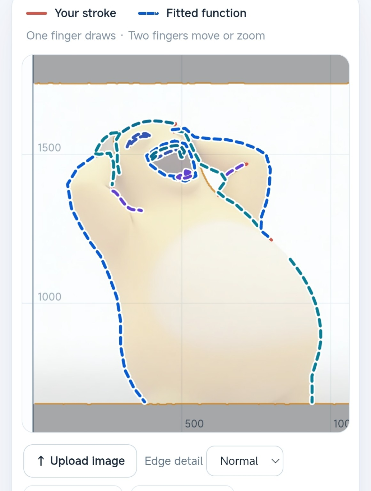
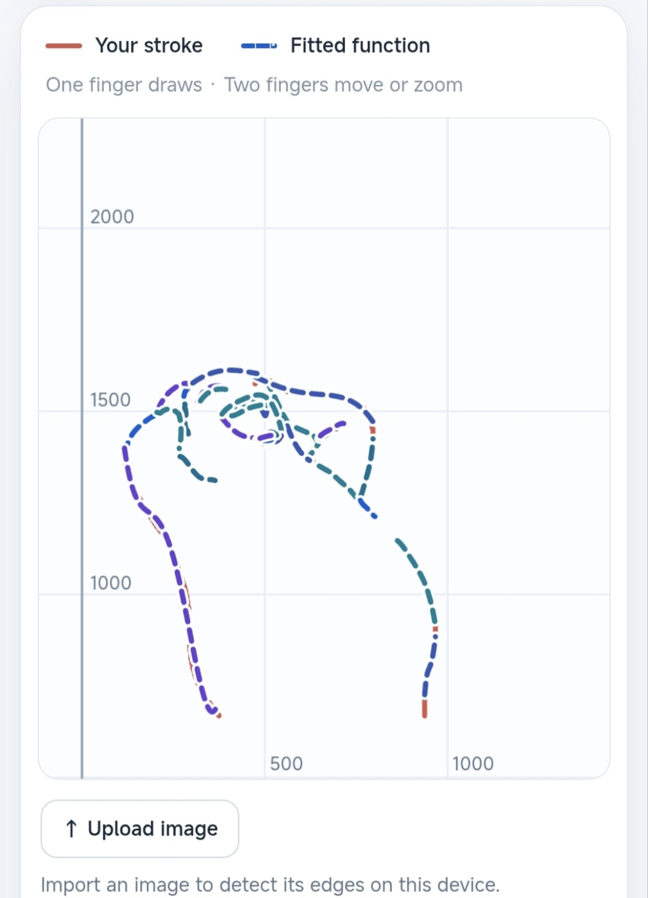
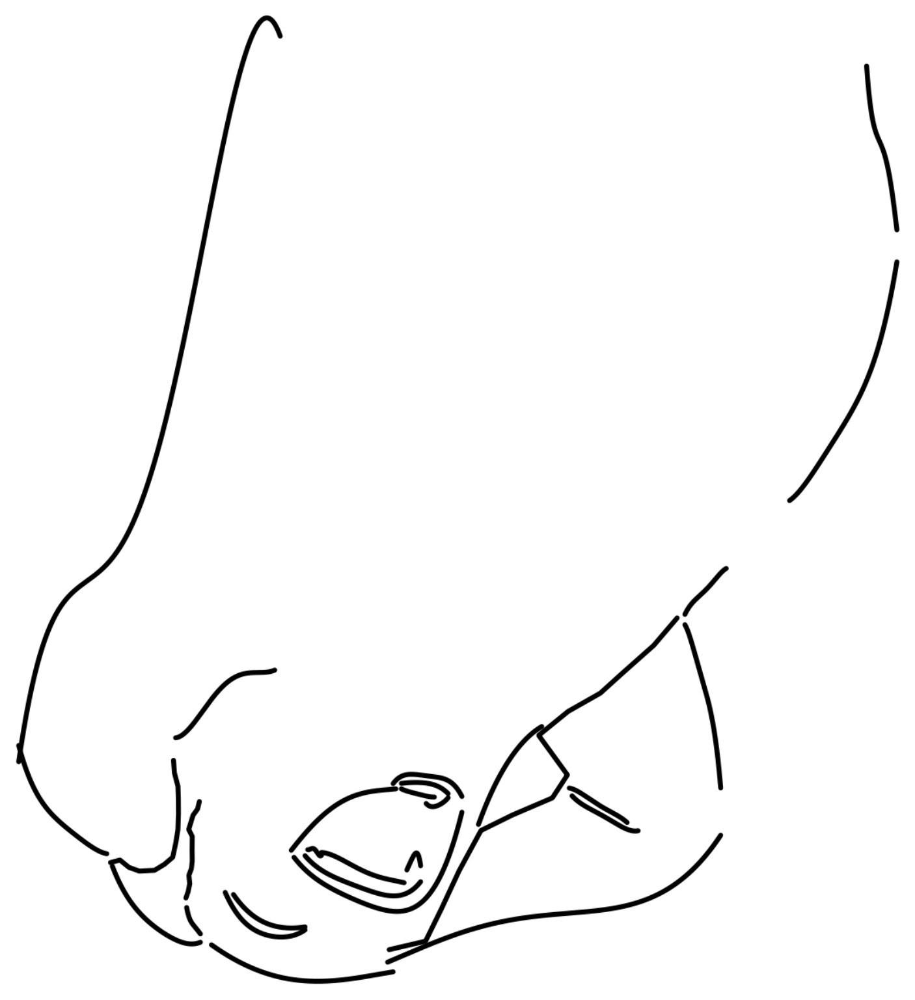
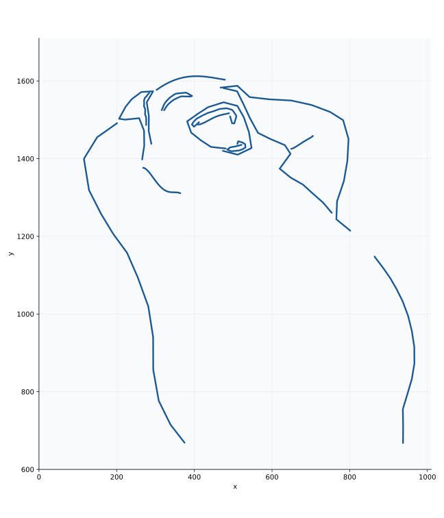

# UnDraw

[English](README.en.md) · [简体中文](README.md)

**随手画条曲线，找出它的数学表达式。** [打开在线演示](https://systina12.github.io/UnDraw/)。

也许人人都能画出自己的奶蛙表达式

UnDraw 能为手绘曲线和图片中的线条寻找表达式。拟合与边缘识别都在浏览器的 Web Worker 中运行。

## 演示

<p align="center">
  
  
  
</p>

手绘输入 · 图片描边 · 拟合曲线

## 奶蛙表达式

下面的图由 Python 按这 14 段表达式绘制。参数式取 $t \in [0,1]$；四段 $y(x)$ 按原始归一化区间 $(x-x_c)/x_s \in [-1,1]$ 绘制。



重绘：安装 `numpy` 和 `matplotlib` 后运行 `python docs/plot_naiwa.py`。

<details>
<summary>展开 14 段表达式</summary>

**第 1 段**（$0 \le t \le 1$）

$$
\begin{aligned}
x(t)&= 53.9359 + 111.529\cdot \left|t-0.0769231\right| + 306.817\cdot \left|t-0.153846\right| + 117.354\cdot \left|t-0.230769\right| \\
&\quad + 0.867373\cdot \left|t-0.307692\right| + 25.9058\cdot \left|t-0.384615\right| - 47.6153\cdot \left|t-0.461538\right| \\
&\quad - 6.12977\cdot \left|t-0.538462\right| - 95.0591\cdot \left|t-0.615385\right| - 78.8826\cdot \left|t-0.692308\right| \\
&\quad + 91.362\cdot \left|t-0.769231\right| + 104.243\cdot \left|t-0.846154\right| + 36.7385\cdot \left|t-0.923077\right| \\
&\quad - 99.2364\cdot t \\
y(t)&= 1380.97 - 125.962\cdot \left|t-0.0769231\right| - 163.637\cdot \left|t-0.153846\right| + 126.599\cdot \left|t-0.230769\right| \\
&\quad + 62.7068\cdot \left|t-0.307692\right| + 23.1575\cdot \left|t-0.384615\right| - 103.784\cdot \left|t-0.461538\right| \\
&\quad - 68.2104\cdot \left|t-0.538462\right| - 28.833\cdot \left|t-0.615385\right| - 31.7102\cdot \left|t-0.692308\right| \\
&\quad + 23.4519\cdot \left|t-0.769231\right| + 121.678\cdot \left|t-0.846154\right| + 98.7917\cdot \left|t-0.923077\right| \\
&\quad - 536.103\cdot t
\end{aligned}
$$

**第 2 段**（$\displaystyle x \in [268, 364]$）

$$
\begin{aligned}
y_{2}&=1324.55 + \left(-1.3956 + \left(1.39205 + \left(0.321735 + -0.761374\cdot \frac{-316 + x}{48}\right)\cdot \frac{-316 + x}{48}\right)\cdot \frac{-316 + x}{48}\right)\cdot 30.5333\cdot \frac{-316 + x}{48}
\end{aligned}
$$

**第 3 段**（$0 \le t \le 1$）

$$
\begin{aligned}
x(t)&= 311.998 + 47.6194\cdot \left|t-0.0769231\right| - 38.6335\cdot \left|t-0.153846\right| + 141.772\cdot \left|t-0.230769\right| \\
&\quad - 305.566\cdot \left|t-0.307692\right| + 39.5773\cdot \left|t-0.384615\right| + 58.4719\cdot \left|t-0.461538\right| \\
&\quad - 8.18482\cdot \left|t-0.538462\right| + 212.161\cdot \left|t-0.615385\right| + 130.889\cdot \left|t-0.692308\right| \\
&\quad - 151.675\cdot \left|t-0.769231\right| - 79.1789\cdot \left|t-0.846154\right| - 37.317\cdot \left|t-0.923077\right| \\
&\quad - 79.0489\cdot t \\
y(t)&= 1648.62 + 27.9794\cdot \left|t-0.0769231\right| - 11.5636\cdot \left|t-0.153846\right| - 48.5726\cdot \left|t-0.230769\right| \\
&\quad - 198.031\cdot \left|t-0.307692\right| - 106.709\cdot \left|t-0.384615\right| - 6.33606\cdot \left|t-0.461538\right| \\
&\quad - 74.4178\cdot \left|t-0.538462\right| + 185.891\cdot \left|t-0.615385\right| + 39.3598\cdot \left|t-0.692308\right| \\
&\quad - 233.176\cdot \left|t-0.769231\right| - 42.7723\cdot \left|t-0.846154\right| + 20.9109\cdot \left|t-0.923077\right| \\
&\quad - 13.6269\cdot t
\end{aligned}
$$

**第 4 段**（$0 \le t \le 1$）

$$
\begin{aligned}
x(t)&= 279.593 + 10.4945\cdot \left|t-0.0769231\right| - 4.34977\cdot \left|t-0.153846\right| + 12.2719\cdot \left|t-0.230769\right| \\
&\quad + 15.7576\cdot \left|t-0.307692\right| - 7.02429\cdot \left|t-0.384615\right| + 22.3249\cdot \left|t-0.461538\right| \\
&\quad - 16.545\cdot \left|t-0.538462\right| - 5.91554\cdot \left|t-0.615385\right| + 20.6892\cdot \left|t-0.692308\right| \\
&\quad - 12.7972\cdot \left|t-0.769231\right| - 5.22066\cdot \left|t-0.846154\right| + 1.47688\cdot \left|t-0.923077\right| \\
&\quad - 30.4415\cdot t \\
y(t)&= 1575.12 + 11.0662\cdot \left|t-0.111111\right| - 20.7498\cdot \left|t-0.222222\right| - 4.40576\cdot \left|t-0.333333\right| \\
&\quad + 7.52514\cdot \left|t-0.444444\right| - 7.17383\cdot \left|t-0.555556\right| + 6.10107\cdot \left|t-0.666667\right| \\
&\quad - 3.93133\cdot \left|t-0.777778\right| - 1.40954\cdot \left|t-0.888889\right| - 81.238\cdot t
\end{aligned}
$$

**第 5 段**（$\displaystyle x \in [302.667, 478.667]$）

$$
\begin{aligned}
y_{5}&=1611.74 + \left(0.521522 + \left(-1.65774 + \left(0.382199 + 0.163053\cdot \frac{-390.667 + x}{88}\right)\cdot \frac{-390.667 + x}{88}\right)\cdot \frac{-390.667 + x}{88}\right)\cdot 14.4667\cdot \frac{-390.667 + x}{88}
\end{aligned}
$$

**第 6 段**（$0 \le t \le 1$）

$$
\begin{aligned}
x(t)&= 364.856 + 10.2648\cdot \left|t-0.0769231\right| + 12.4628\cdot \left|t-0.153846\right| + 11.6923\cdot \left|t-0.230769\right| \\
&\quad + 34.7978\cdot \left|t-0.307692\right| + 11.9154\cdot \left|t-0.384615\right| - 38.6258\cdot \left|t-0.461538\right| \\
&\quad - 185.959\cdot \left|t-0.538462\right| + 0.0360499\cdot \left|t-0.615385\right| + 22.1295\cdot \left|t-0.692308\right| \\
&\quad + 20.7512\cdot \left|t-0.769231\right| + 8.65569\cdot \left|t-0.846154\right| + 10.4455\cdot \left|t-0.923077\right| \\
&\quad - 10.4403\cdot t \\
y(t)&= 1594.78 - 25.1712\cdot \left|t-0.111111\right| - 9.61936\cdot \left|t-0.222222\right| - 38.5272\cdot \left|t-0.333333\right| \\
&\quad - 56.0657\cdot \left|t-0.444444\right| + 47.7402\cdot \left|t-0.555556\right| - 42.5689\cdot \left|t-0.666667\right| \\
&\quad - 10.9014\cdot \left|t-0.777778\right| - 19.0415\cdot \left|t-0.888889\right| + 14.0296\cdot t
\end{aligned}
$$

**第 7 段**（$0 \le t \le 1$）

$$
\begin{aligned}
x(t)&= 843.362 - 22.7404\cdot \left|t-0.0769231\right| + 2.57224\cdot \left|t-0.153846\right| - 37.3245\cdot \left|t-0.230769\right| \\
&\quad + 17.4825\cdot \left|t-0.307692\right| + 367.306\cdot \left|t-0.384615\right| - 276.033\cdot \left|t-0.461538\right| \\
&\quad - 148.383\cdot \left|t-0.538462\right| + 37.5475\cdot \left|t-0.615385\right| + 70.567\cdot \left|t-0.692308\right| \\
&\quad + 31.9064\cdot \left|t-0.769231\right| - 6.86857\cdot \left|t-0.846154\right| - 118.746\cdot \left|t-0.923077\right| \\
&\quad - 375.336\cdot t \\
y(t)&= 1367.52 - 22.637\cdot \left|t-0.0769231\right| + 2.20682\cdot \left|t-0.153846\right| - 35.9662\cdot \left|t-0.230769\right| \\
&\quad + 35.9487\cdot \left|t-0.307692\right| + 97.4056\cdot \left|t-0.384615\right| - 103.685\cdot \left|t-0.461538\right| \\
&\quad - 41.4854\cdot \left|t-0.538462\right| - 2.28306\cdot \left|t-0.615385\right| + 147.326\cdot \left|t-0.692308\right| \\
&\quad - 25.367\cdot \left|t-0.769231\right| + 1.32453\cdot \left|t-0.846154\right| - 171.011\cdot \left|t-0.923077\right| \\
&\quad + 225.446\cdot t
\end{aligned}
$$

**第 8 段**（$0 \le t \le 1$）

$$
\begin{aligned}
x(t)&= 724.784 + 77.3888\cdot \left|t-0.0769231\right| + 5.76376\cdot \left|t-0.153846\right| + 94.0956\cdot \left|t-0.230769\right| \\
&\quad + 251.054\cdot \left|t-0.307692\right| - 16.6003\cdot \left|t-0.384615\right| + 95.3715\cdot \left|t-0.461538\right| \\
&\quad - 29.6313\cdot \left|t-0.538462\right| - 125.497\cdot \left|t-0.615385\right| - 19.0234\cdot \left|t-0.692308\right| \\
&\quad - 43.26\cdot \left|t-0.769231\right| - 275.879\cdot \left|t-0.846154\right| - 15.6878\cdot \left|t-0.923077\right| \\
&\quad - 493.509\cdot t \\
y(t)&= 1359.18 + 84.1538\cdot \left|t-0.0769231\right| + 18.6533\cdot \left|t-0.153846\right| + 60.289\cdot \left|t-0.230769\right| \\
&\quad - 59.9609\cdot \left|t-0.307692\right| - 20.7951\cdot \left|t-0.384615\right| - 25.6173\cdot \left|t-0.461538\right| \\
&\quad - 143.185\cdot \left|t-0.538462\right| - 126.893\cdot \left|t-0.615385\right| - 62.5591\cdot \left|t-0.692308\right| \\
&\quad - 16.6457\cdot \left|t-0.769231\right| + 155.236\cdot \left|t-0.846154\right| + 175.477\cdot \left|t-0.923077\right| \\
&\quad + 89.8115\cdot t
\end{aligned}
$$

**第 9 段**（$0 \le t \le 1$）

$$
\begin{aligned}
x(t)&= 369.584 + 4.95868\cdot \left|t-0.111111\right| - 96.1895\cdot \left|t-0.222222\right| - 65.8355\cdot \left|t-0.333333\right| \\
&\quad + 19.3675\cdot \left|t-0.444444\right| + 14.6868\cdot \left|t-0.555556\right| + 0.923033\cdot \left|t-0.666667\right| \\
&\quad + 32.2216\cdot \left|t-0.777778\right| + 138.023\cdot \left|t-0.888889\right| + 116.535\cdot t \\
y(t)&= 1425.51 + 113.233\cdot \left|t-0.0769231\right| + 139.403\cdot \left|t-0.153846\right| - 53.5986\cdot \left|t-0.230769\right| \\
&\quad - 49.6338\cdot \left|t-0.307692\right| - 45.9302\cdot \left|t-0.384615\right| - 26.5289\cdot \left|t-0.461538\right| \\
&\quad + 11.3202\cdot \left|t-0.538462\right| - 14.8609\cdot \left|t-0.615385\right| - 5.51966\cdot \left|t-0.692308\right| \\
&\quad - 6.68398\cdot \left|t-0.769231\right| - 30.9166\cdot \left|t-0.846154\right| + 161.374\cdot \left|t-0.923077\right| \\
&\quad - 39.8367\cdot t
\end{aligned}
$$

**第 10 段**（$0 \le t \le 1$）

$$
\begin{aligned}
x(t)&= 401.652 - 74.5951\cdot \left|t-0.0769231\right| + 127.315\cdot \left|t-0.153846\right| + 30.8381\cdot \left|t-0.230769\right| \\
&\quad - 25.7385\cdot \left|t-0.307692\right| - 28.6006\cdot \left|t-0.384615\right| - 90.3324\cdot \left|t-0.461538\right| \\
&\quad - 129.35\cdot \left|t-0.538462\right| - 109.483\cdot \left|t-0.615385\right| - 38.9354\cdot \left|t-0.692308\right| \\
&\quad - 55.5589\cdot \left|t-0.769231\right| + 102.372\cdot \left|t-0.846154\right| + 244.477\cdot \left|t-0.923077\right| \\
&\quad + 513.261\cdot t \\
y(t)&= 1588.5 - 220.429\cdot \left|t-0.0769231\right| + 152.459\cdot \left|t-0.153846\right| + 17.2127\cdot \left|t-0.230769\right| \\
&\quad - 54.6492\cdot \left|t-0.307692\right| - 41.7267\cdot \left|t-0.384615\right| - 21.5387\cdot \left|t-0.461538\right| \\
&\quad - 177.51\cdot \left|t-0.538462\right| - 53.1188\cdot \left|t-0.615385\right| + 30.8688\cdot \left|t-0.692308\right| \\
&\quad + 1.42679\cdot \left|t-0.769231\right| + 34.3697\cdot \left|t-0.846154\right| + 112.069\cdot \left|t-0.923077\right| \\
&\quad - 158.932\cdot t
\end{aligned}
$$

**第 11 段**（$\displaystyle x \in [649.333, 705.333]$）

$$
\begin{aligned}
y_{11}&=1441.31 + \left(1.14606 + \left(-0.251613 + \left(-0.0509976 + 0.291583\cdot \frac{-677.333 + x}{28}\right)\cdot \frac{-677.333 + x}{28}\right)\cdot \frac{-677.333 + x}{28}\right)\cdot 15.2314\cdot \frac{-677.333 + x}{28}
\end{aligned}
$$

**第 12 段**（$0 \le t \le 1$）

$$
\begin{aligned}
x(t)&= 902.106 - 38.7868\cdot \left|t-0.0769231\right| - 12.5459\cdot \left|t-0.153846\right| - 3.19835\cdot \left|t-0.230769\right| \\
&\quad - 6.15551\cdot \left|t-0.307692\right| - 29.4328\cdot \left|t-0.384615\right| - 22.215\cdot \left|t-0.461538\right| \\
&\quad - 38.8924\cdot \left|t-0.538462\right| - 45.718\cdot \left|t-0.615385\right| - 30.8108\cdot \left|t-0.692308\right| \\
&\quad - 0.680062\cdot \left|t-0.769231\right| + 79.9211\cdot \left|t-0.846154\right| - 6.27536\cdot \left|t-0.923077\right| \\
&\quad + 151.726\cdot t \\
y(t)&= 1189.03 + 37.9523\cdot \left|t-0.0769231\right| - 12.285\cdot \left|t-0.153846\right| - 20.1871\cdot \left|t-0.230769\right| \\
&\quad - 48.5797\cdot \left|t-0.307692\right| - 8.23727\cdot \left|t-0.384615\right| - 10.9082\cdot \left|t-0.461538\right| \\
&\quad - 13.2368\cdot \left|t-0.538462\right| + 14.1293\cdot \left|t-0.615385\right| + 14.0498\cdot \left|t-0.692308\right| \\
&\quad - 0.0635502\cdot \left|t-0.769231\right| - 33.0115\cdot \left|t-0.846154\right| + 2.57306\cdot \left|t-0.923077\right| \\
&\quad - 484.285\cdot t
\end{aligned}
$$

**第 13 段**（$0 \le t \le 1$）

$$
\begin{aligned}
x(t)&= 462.37 + 61.0559\cdot \left|t-0.0769231\right| - 30.4957\cdot \left|t-0.153846\right| - 37.0335\cdot \left|t-0.230769\right| \\
&\quad - 53.7258\cdot \left|t-0.307692\right| - 7.00161\cdot \left|t-0.384615\right| - 13.959\cdot \left|t-0.461538\right| \\
&\quad - 6.27327\cdot \left|t-0.538462\right| + 16.7247\cdot \left|t-0.615385\right| + 108.822\cdot \left|t-0.692308\right| \\
&\quad + 16.3511\cdot \left|t-0.769231\right| + 0.0018964\cdot \left|t-0.846154\right| - 13.1794\cdot \left|t-0.923077\right| \\
&\quad + 66.3094\cdot t \\
y(t)&= 1421.01 - 65.9323\cdot \left|t-0.0769231\right| - 7.14652\cdot \left|t-0.153846\right| - 26.3451\cdot \left|t-0.230769\right| \\
&\quad + 26.6996\cdot \left|t-0.307692\right| + 7.26969\cdot \left|t-0.384615\right| + 12.0795\cdot \left|t-0.461538\right| \\
&\quad + 4.3956\cdot \left|t-0.538462\right| + 31.6545\cdot \left|t-0.615385\right| + 9.88336\cdot \left|t-0.692308\right| \\
&\quad - 25.6533\cdot \left|t-0.769231\right| + 3.52174\cdot \left|t-0.846154\right| + 0.705846\cdot \left|t-0.923077\right| \\
&\quad + 60.5068\cdot t
\end{aligned}
$$

**第 14 段**（$\displaystyle x \in [409.333, 489.333]$）

$$
\begin{aligned}
y_{14}&=1505.32 + \left(1.2974 + \left(-0.537147 + \left(-0.284273 + 0.326374\cdot \frac{-449.333 + x}{40}\right)\cdot \frac{-449.333 + x}{40}\right)\cdot \frac{-449.333 + x}{40}\right)\cdot 14.4804\cdot \frac{-449.333 + x}{40}
\end{aligned}
$$

</details>

## 怎么玩

1. 在坐标系里画一笔或多笔；也可以点 **Upload image** 上传图片，再点选需要拟合的边缘。用 **Draw by hand** 可以在图片上补画。
2. 选择 **One per stroke**（每笔一个函数）或 **Best fit · auto count**（自动决定函数数量），然后点 **Find functions**。结果会逐步出现；继续画新笔可以打断当前计算。
3. 比较 **Simple**、**Balanced** 和默认选中的 **Accurate**。展开 **Prefer shorter formulas**，可以用少量视觉误差换取更简短的系数，默认限度为 5%。结果可以复制为 LaTeX 或普通文本。

按住 Shift 拖动或用鼠标中键平移，滚轮或双指缩放；支持撤销、清空和重置视图。对于无法表示为 `y = f(x)` 的曲线，程序还可以给出参数形式 `x(t)`、`y(t)`。

## 本地运行

需要 Node.js 22 或更新版本。

```sh
npm ci
npm run dev
```

运行 `npm test` 执行测试，或用 `npm run build` 构建可安装、支持离线计算的正式版本。正式版首次联网加载后即可离线计算。界面使用 Canvas 和 KaTeX；独立于界面的求解器在 `src/core/solver.ts` 中导出 `solveCurve(points, options)`。

## 隐私

笔迹和上传的图片在你的设备上处理。页面通过 Cloudflare Web Analytics 统计访问量。

本项目使用 [MIT 许可证](LICENSE)。
