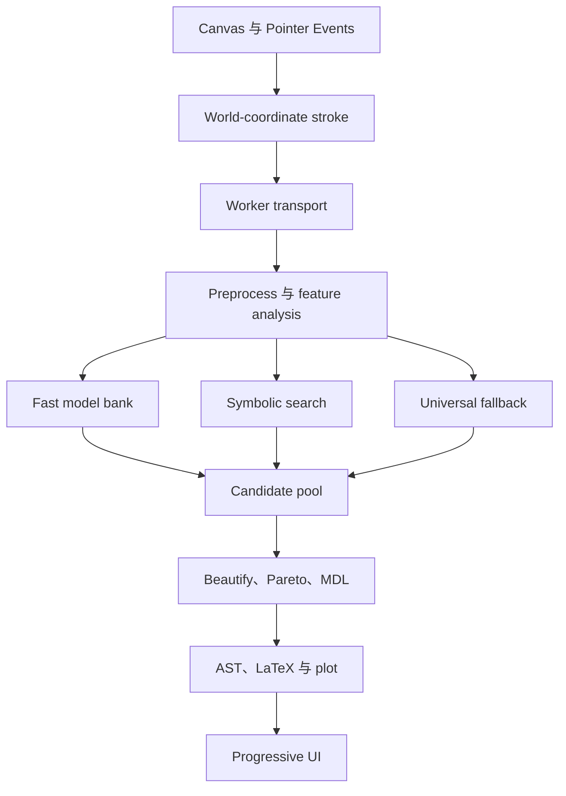

# UnDraw：Hand-drawn Function Finder 设计规格

- 状态：已在 `soltest` 实现；生产构建与 Chromium 端到端测试通过
- 日期：2026-09-21
- 目标分支：`soltest`
- 技术栈：Vite、TypeScript、Canvas 2D、Web Worker、KaTeX、Vitest、Playwright

## 1. 产品目标

UnDraw 是一个完全在浏览器内运行的手绘函数识别器。用户在数学坐标系中画出一条曲线，系统分析笔迹并返回既贴近曲线、又符合人类数学直觉的表达式。

第一版必须形成完整闭环：

1. 用户直接在坐标系中画线；
2. 松手后立即开始求解；
3. 主线程保持流畅；
4. 先快速显示可用候选，再渐进改善；
5. 同时展示 Simple、Balanced、Accurate 三个 Pareto 候选；
6. 显示拟合曲线、匹配质量与诊断信息；
7. 支持复制 LaTeX 和纯文本表达式；
8. 识别失败时仍通过通用近似给出稳定结果；
9. 非单值笔迹自动进入参数曲线模式；
10. 页面资源缓存完成后，可在断网状态重新打开并计算。

核心产品原则是：

> 在用户笔迹所允许的噪声范围内，寻找最短、最自然的数学描述。

因此，对接近 `2.001 sin(3.1408x + 0.003)` 的笔迹，`2 sin(πx)` 应获得更高优先级。

## 2. 第一版边界

### 2.1 纳入范围

- 单条主笔迹；
- 普通函数 `y=f(x)`；
- 非单值笔迹的参数曲线 fallback；
- 多项式、三角、Fourier、指数、对数、绝对值、低阶有理式、Gaussian、tanh、Logistic、阻尼正弦；
- 有界符号搜索；
- Chebyshev 与 Fourier 通用近似；
- 常数漂亮化、AST 化简、MDL/BIC 混合评分；
- 平移、缩放、重置、撤销和清除；
- 响应式桌面与移动端 UI；
- 自动化单元、集成、合成恢复、Worker 和端到端测试。

### 2.2 暂缓范围

- 多条独立笔迹组成的分段函数；
- 隐式方程 `F(x,y)=0`；
- 三维曲线；
- 用户自定义符号 grammar；
- 服务器计算、账户或云端保存；
- 任意计算机代数系统级恒等证明；
- 训练或下载机器学习模型。

参数曲线 fallback 能覆盖圆、回头曲线和竖直段，但不会尝试把它们转写成隐式方程。

## 3. 关键设计决策

### 3.1 UI 使用 Vanilla TypeScript

页面交互规模有限，使用轻量状态模型与模块化 DOM 组件即可。求解核心与 UI 完全解耦，避免框架生命周期进入算法层。

### 3.2 核心同时提供同步与渐进 API

```ts
export function solveCurve(
  points: readonly Point[],
  options?: Partial<SolverOptions>,
): SolveResult;

export async function solveCurveProgressive(
  points: readonly Point[],
  options: Partial<SolverOptions>,
  hooks: SolveHooks,
): Promise<SolveResult>;
```

- `solveCurve` 用于 Node.js、测试、基准和未来嵌入环境；
- `solveCurveProgressive` 使用相同阶段函数，在批次边界让出事件循环并发送中间结果；
- 算法层不直接访问 `WorkerGlobalScope`、DOM 或时间 API；时间、取消和进度通过 `SolveHooks` 注入。

```ts
export interface SolveHooks {
  now(): number;
  shouldAbort(): boolean;
  emit(progress: SolveProgress): void;
  yieldControl(): Promise<void>;
}
```

同步 API 使用结构数量和迭代次数上限，默认不受墙钟 deadline 影响，以便测试结果完全可复现。渐进 API 由调用方提供单调时钟和 deadline。无法形成有效曲线时，同步 API 抛出带 `InvalidReason` 的 `InvalidCurveError`；Worker 将其映射为 `invalid` 消息，数值候选失败不会使用异常控制正常流程。

### 3.3 参数曲线使用判别联合结果

普通函数候选包含一个表达式；参数候选包含 `x(t)` 与 `y(t)` 两个表达式。二者共享评分、Pareto 和诊断框架，但保持静态类型清晰。

### 3.4 数值拟合与最终表达分离

拟合阶段可使用归一化坐标、Chebyshev 系数和内部参数节点。候选入池前必须转换为统一 AST。UI、LaTeX 和绘图只读取最终 AST。

### 3.5 漂亮常数参与模型竞争

漂亮化生成新的候选变体，并重新计算完整误差与 MDL 分数。显示层不会擅自格式化浮点参数，从而保证公式、评分和绘图一致。

### 3.6 时间预算是上限

快速模型库目标为 100 ms 内完成；完整搜索在桌面端通常控制于 1.5 s、移动端通常控制于 3 s。每个阶段持有 deadline 并定期检查，不通过人工延迟凑时间。

## 4. 总体架构



### 4.1 模块边界

| 模块 | 责任 | 允许依赖 |
|---|---|---|
| `ui/` | 输入、视口、DOM、Canvas、复制与状态展示 | `core/types`、Worker client |
| `worker/` | 消息协议、取消、时间预算、渐进响应 | `core/solver` |
| `core/` | 管线编排、预处理、特征、结果组装 | `math/`、`expr/`、`models/`、`search/` |
| `math/` | 小型稳定数值库 | 无 UI 依赖 |
| `expr/` | AST、求值、化简、哈希、序列化 | 少量 `math/` 工具 |
| `models/` | 专用模型拟合与 AST 构造 | `math/`、`expr/`、核心数据类型 |
| `search/` | producer、候选池、符号 grammar、Pareto 和评分 | `math/`、`expr/`、`models/` |
| `beautify/` | 常数候选与组合搜索 | `expr/`、候选评价器 |

任何低层模块均不得导入 `ui/` 或 `worker/`。

## 5. 目录结构

```text
src/
  core/
    types.ts
    options.ts
    solver.ts
    progressive.ts
    preprocess.ts
    validateFunction.ts
    resample.ts
    smooth.ts
    normalize.ts
    features.ts
    noise.ts
    quality.ts
  math/
    vector.ts
    matrix.ts
    qr.ts
    leastSquares.ts
    linearSolve.ts
    brent.ts
    lm.ts
    robust.ts
    fft.ts
    statistics.ts
  expr/
    ast.ts
    template.ts
    evaluate.ts
    canonical.ts
    simplify.ts
    substitute.ts
    polynomial.ts
    latex.ts
    plain.ts
    complexity.ts
    serialize.ts
  models/
    shared.ts
    polynomial.ts
    sinusoid.ts
    fourier.ts
    exponential.ts
    logarithm.ts
    absolute.ts
    rational.ts
    gaussian.ts
    tanh.ts
    logistic.ts
    dampedSinusoid.ts
  search/
    producer.ts
    modelBank.ts
    symbolic.ts
    grammar.ts
    semanticHash.ts
    candidatePool.ts
    pareto.ts
    scoring.ts
    fallback.ts
  beautify/
    rational.ts
    constants.ts
    beautify.ts
  worker/
    protocol.ts
    solver.worker.ts
    client.ts
  ui/
    app.ts
    state.ts
    canvas.ts
    viewport.ts
    gestures.ts
    plot.ts
    formulaPanel.ts
    controls.ts
    styles.css
  main.ts
tests/
  unit/
  integration/
  synthetic/
  browser/
  fixtures/
benchmarks/
  solver.bench.ts
public/
  icons/
  manifest.webmanifest
```

文件应保持单一职责。超过约 300 行且承担多种职责的文件需要继续拆分。

## 6. 公共数据契约

### 6.1 输入与视口

```ts
export interface Point {
  x: number;
  y: number;
  t: number;
}

export interface Viewport {
  xMin: number;
  xMax: number;
  yMin: number;
  yMax: number;
}

export interface SolverOptions {
  sampleCount: number;
  functionBucketCount: number;
  maxStructuralComplexity: number;
  maxFreeParameters: number;
  semanticBeamWidth: number;
  combinationWidth: number;
  beautifyBeamWidth: number;
  timeBudgetMs: number | null;
  enableParametricFallback: boolean;
  deterministicSeed: number;
}
```

默认值分别为 `256`、`128`、`12`、`8`、`300`、`48`、`32`。同步调用的时间预算默认为 `null`；渐进调用由 UI 根据设备类型传入明确数值。

### 6.2 表达式 AST

```ts
export type VariableName = "x" | "t";

export type Constant =
  | { kind: "float"; value: number }
  | { kind: "integer"; value: number }
  | { kind: "rational"; p: number; q: number }
  | { kind: "piMultiple"; p: number; q: number }
  | { kind: "eMultiple"; p: number; q: number }
  | { kind: "sqrtMultiple"; p: number; q: number; n: number };

export type Expr =
  | { kind: "var"; name: VariableName }
  | { kind: "const"; value: Constant }
  | { kind: "add"; args: Expr[] }
  | { kind: "mul"; args: Expr[] }
  | { kind: "div"; a: Expr; b: Expr }
  | { kind: "pow"; base: Expr; exponent: Expr }
  | { kind: "sin"; arg: Expr }
  | { kind: "cos"; arg: Expr }
  | { kind: "exp"; arg: Expr }
  | { kind: "log"; arg: Expr }
  | { kind: "abs"; arg: Expr }
  | { kind: "sqrt"; arg: Expr };
```

符号搜索额外使用内部 `TemplateExpr`，其 `param` 节点只存在于拟合期间，绝不会进入 `SolveResult`。

### 6.3 候选

```ts
export interface FitMetrics {
  rmse: number;
  normalizedRmse: number;
  huberError: number;
  maxError: number;
  validFraction: number;
}

export interface Candidate {
  expr: Expr;
  params: number[];
  metrics: FitMetrics;
  operatorComplexity: number;
  constantComplexity: number;
  freeParameterCount: number;
  score: number;
  structuralSignature: string;
  semanticSignature: string;
  modelFamily: string;
  approximation: boolean;
}
```

参数曲线候选包含两个 `Expr`，同时保存联合误差与联合复杂度。联合 RMSE 使用二维欧氏距离，并除以世界坐标中笔迹包围盒的对角尺度进行归一化。

### 6.4 最终结果

```ts
export type MatchQuality =
  | "excellent"
  | "good"
  | "approximation"
  | "low";

export interface CandidateResult {
  expr: Expr;
  latex: string;
  plain: string;
  rmse: number;
  normalizedRmse: number;
  complexity: number;
  score: number;
  modelFamily: string;
  approximation: boolean;
  plot: { x: number[]; y: number[] };
}

export interface ParametricCandidateResult {
  xExpr: Expr;
  yExpr: Expr;
  latex: string;
  plain: string;
  rmse: number;
  normalizedRmse: number;
  complexity: number;
  score: number;
  modelFamily: string;
  approximation: boolean;
  plot: { x: number[]; y: number[]; t: number[] };
}

export interface SolveDiagnostics {
  runtimeMs: number;
  candidatesGenerated: number;
  candidatesFitted: number;
  candidatesRejected: number;
  maxComplexityReached: number;
  stoppedBy: "noise-floor" | "stagnation" | "deadline" | "limit";
}

export type SolveResult =
  | {
      mode: "function";
      best: CandidateResult;
      simple: CandidateResult;
      balanced: CandidateResult;
      accurate: CandidateResult;
      pareto: CandidateResult[];
      domain: [number, number];
      noise: number;
      quality: MatchQuality;
      diagnostics: SolveDiagnostics;
    }
  | {
      mode: "parametric";
      best: ParametricCandidateResult;
      simple: ParametricCandidateResult;
      balanced: ParametricCandidateResult;
      accurate: ParametricCandidateResult;
      pareto: ParametricCandidateResult[];
      domain: [0, 1];
      noise: number;
      quality: MatchQuality;
      diagnostics: SolveDiagnostics;
    };
```

## 7. Canvas、坐标与输入

### 7.1 坐标变换

Canvas 的 CSS 大小与 backing store 大小分离，backing store 乘以 `devicePixelRatio`，所有交互坐标先换算到 CSS 像素。

```text
x = xMin + px / width  × (xMax - xMin)
y = yMax - py / height × (yMax - yMin)
```

反向变换集中在 `ViewportTransform` 中。绘图、命中测试和输入不得各自复制公式。

### 7.2 指针采集

- 主按钮或单指开始绘制；
- 使用 `setPointerCapture` 保证出界后仍能结束笔迹；
- 优先读取 `getCoalescedEvents()`；
- 相邻点屏幕距离低于 0.5 px 且时间差很小时合并，避免无意义密集点；
- 时间戳使用 `event.timeStamp`，仅用于诊断和未来动态权重；
- 输入阶段不按 x 排序；
- `pointercancel` 结束当前交互并保留已采集点，点数不足时丢弃。

### 7.3 手势

- 鼠标滚轮围绕光标位置缩放；
- 空格拖动、中键拖动或触控双指拖动用于平移；
- 双击或按钮恢复 `[-5,5] × [-5,5]`；
- 绘制过程中冻结视口，避免同一笔迹使用两套坐标变换；
- 缩放范围限制为每轴跨度 `[1e-3, 1e6]`。

### 7.4 Undo 与 Clear

第一版只求解一条主曲线，但保留最多 20 个 UI 快照。Undo 恢复上一条笔迹和对应结果；Clear 清空笔迹与结果；Reset view 只修改视口。

## 8. 预处理管线

### 8.1 输入清洗

依次执行：

1. 删除 NaN、Infinity；
2. 合并距离低于世界坐标尺度 `1e-9` 的连续重复点；
3. 少于 8 个有效点时返回 `too-few-points`；
4. 用 1% 与 99% 分位数估算鲁棒包围盒，避免单个跳点扩张尺度；
5. 计算弧长；总弧长过小时返回 `stroke-too-small`。

### 8.2 初始噪声估计

函数验证需要噪声阈值，而正式噪声又依赖重采样和平滑。为消除循环依赖，先在原始轨迹上计算初始噪声：

1. 对每个内部点，用前后各两个点形成局部线性预测；
2. 计算点到预测位置的垂直残差和正交残差；
3. 对残差使用 MAD；
4. 将结果限制在鲁棒 y 范围的 `[1e-5, 0.2]` 倍内。

这个估计只服务于函数验证。正式模型评分使用平滑后残差得到的 `sigmaDraw`。

### 8.3 判断是否为 `y=f(x)`

将鲁棒 x 域划为 128 个 bucket，每个 bucket 保存样本数、`median(y)`、`y05`、`y95` 和轨迹访问区段。

bucket 的鲁棒竖直跨度为：

```text
spread = y95 - y05
threshold = max(4 × sigmaPre, 0.05 × yRange)
```

一个 bucket 同时满足以下条件时标记为多值：

- 至少有 4 个样本；
- `spread > threshold`；
- 高低 y 样本来自两个可分离的轨迹访问区段，防止局部抖动误判。

进入参数模式的条件：

- 鲁棒 x 跨度低于包围盒对角尺度的 2%；或
- 多值 bucket 占有效 bucket 超过 5%，且至少出现一组连续 3 个多值 bucket。

这样，反复描摹同一函数曲线仍可通过验证，圆和明显回头曲线会进入参数模式。

### 8.4 普通函数重采样

1. 每个 x bucket 使用 `median(y)`；
2. 找出有效 bucket 的连续区段；
3. 不超过 3 个 bucket 的小缺口线性填补；
4. 对更大缺口选择 x 覆盖范围最大的连续区段作为有效 domain；
5. 在该 domain 上生成 256 个均匀 x；
6. 使用相邻 bucket median 做分段线性插值。

输出同时保留：

- `rawY`：供最终误差评分；
- `smoothY`：供导数、FFT、极值和初值分析；
- 每个采样点的 coverage 权重：靠近插值缺口时略降权。

### 8.5 平滑与正式噪声

平滑链：

```text
median filter, radius 2
→ Savitzky–Golay, window 11, degree 3
```

边界使用缩短窗口的局部三次拟合，避免镜像制造伪极值。若样本不足 11，自动选择不大于样本数的最大奇数窗口。

```text
r = rawY - smoothY
sigmaDraw = 1.4826 × median(|r - median(r)|)
```

噪声下限取 `max(1e-9, 1e-6 × robustYRange)`，避免无噪声合成数据造成除零。

### 8.6 参数曲线重采样

以累积弧长定义：

```text
t = arcLength / totalArcLength,  t ∈ [0,1]
```

在均匀的 256 个 t 上分别线性插值 `x(t)` 与 `y(t)`，再对两个分量独立平滑。参数曲线求解调用标量 solver 的内部入口，跳过 `y=f(x)` 验证。两个分量共享时间预算，并使用联合候选选择器组合 Simple、Balanced、Accurate。

闭合笔迹在首尾距离小于包围盒对角线 4% 时标记为 closed。周期模型在参数模式下因此获得更高优先级。

## 9. 归一化

普通函数：

```text
xc = (xmin + xmax) / 2
xs = max((xmax - xmin) / 2, epsilon)
u  = (x - xc) / xs

yc = median(y)
ys = max((percentile95(y) - percentile5(y)) / 2, epsilon)
v  = (y - yc) / ys
```

参数分量使用 `t ∈ [0,1]` 作为输入，每个输出分量独立计算中心和尺度。

所有拟合、Huber 阈值和优化都在归一化空间运行。最终候选执行符号代换：

```text
u → (x - xc) / xs
y → yc + ys × v(u)
```

随后再次 canonicalize、simplify 和 beautify。评分同时保存世界单位 RMSE 与无量纲 normalized RMSE。

## 10. Feature analysis

Feature 只调整执行顺序、初值和预算份额，不直接选定公式。

计算内容：

- 一阶、二阶 central difference；
- 极值数与显著度；
- 零点数；
- 单调区间比例；
- 偶对称和奇对称误差；
- cusp 分数；
- 自相关周期峰；
- Hann 窗 FFT 峰值、峰宽和谱集中度；
- `y'' ≈ k`、`y'' ≈ -ky`、`y' ≈ ky` 的稳健回归质量；
- 曲率峰；
- 首尾值与导数连续程度。

优先级示例：

- 二阶导接近零：linear 与低阶 polynomial 提前；
- 单一窄 FFT 峰：sinusoid 提前；
- 多个谐波峰：Fourier 提前；
- 单个显著 cusp：absolute/hinge 提前；
- `y'/y` 稳定：exponential 提前；
- S 形单调曲线：tanh 与 logistic 提前。

即便优先级很低，基础预算内的常见模型仍会至少运行一次。

## 11. 数值核心

### 11.1 数据表示

- 向量使用 `Float64Array`；
- 矩阵使用 row-major `Float64Array` 加行列元数据；
- 热路径复用工作缓冲区；
- API 边界返回普通数组，便于结构化克隆和测试。

### 11.2 QR 与最小二乘

使用 Householder QR：

- 求解前按列二范数缩放；
- rank tolerance 为 `epsilon × max(m,n) × |R00|`；
- 秩亏时返回最小范数近似并附带 rank；
- weighted least squares 将每行和目标乘以 `sqrt(weight)`；
- 禁止显式构造 `(AᵀA)⁻¹`。

### 11.3 一维优化

频率、指数率、断点和 log shift 使用：

1. 有界粗网格；
2. 保留若干局部最优区间；
3. Brent minimization 精化；
4. 达到参数相对变化 `1e-7` 或误差改善 `1e-9` 时停止。

无合法 bracket 时退化为 golden-section 搜索。

### 11.4 Levenberg–Marquardt

- 最大参数数 8；
- 默认最大迭代 60；
- central finite difference Jacobian；
- `h_j = 1e-5 × max(1, |theta_j|)`；
- 每轮用 Huber IRLS 权重构造 weighted least squares；
- damping 根据 actual/predicted reduction 比率调整；
- 连续 6 次拒绝 step、梯度很小或改善很小时停止；
- 每个结构 4–8 个确定性 multi-start；
- 有正值约束的参数使用 log 参数化；
- 有区间约束的参数使用 logistic 参数化。

### 11.5 Huber loss

归一化空间：

```text
delta = max(1.5 × sigmaNormalized, 0.01)
```

候选保存 RMSE、平均 Huber loss、最大绝对误差和有效样本比例。排名主要使用 RMSE/MDL；Huber loss 用于稳健拟合和离群点情况下的 tie-break。

### 11.6 FFT

256 点使用 radix-2 Cooley–Tukey FFT：

- 先移除均值与线性趋势；
- 使用 Hann 窗；
- 忽略 DC；
- 对局部峰做抛物线插值得到频率初值；
- 同时考虑峰频率的 `1/2`、`1/3`，以避免把高次谐波误当基频。

FFT 只生成初值，最终频率由连续优化确定。

## 12. AST、求值与化简

### 12.1 安全求值

求值器返回 `{ value, valid }`。安全规则：

- `|denominator| < 1e-10` 无效；
- log 参数 `<= 0` 无效；
- sqrt 参数 `< -1e-12` 无效，微小负值钳制为 0；
- exp 参数钳制到 `[-30,30]`；
- 中间值绝对值超过 `1e100` 无效；
- 任意 NaN/Infinity 立即无效。

候选在有效 domain 内有效比例低于 98% 时拒绝。仅在明确建模渐近线的未来模式中才放宽该规则。

### 12.2 Canonicalization

- flatten 嵌套 Add/Mul；
- Add/Mul 参数按 structural hash 排序；
- 常数统一到最简分数与正分母；
- `x*x → x²`；
- 移除加法零项和乘法一项；
- 任一乘法零项令整体为零；
- 合并重复项与重复因子；
- 拒绝 `abs(abs(x))` 等直接冗余结构；
- structural hash 使用稳定文本编码，不依赖对象地址。

### 12.3 Simplification

至少覆盖：

```text
a + 0 → a                 a × 0 → 0
a × 1 → a                 a × -1 → -a
a + a → 2a                x¹ → x
x⁰ → 1                    sqrt(x²) → |x|
sin(-x) → -sin(x)         cos(-x) → cos(x)
exp(0) → 1                log(1) → 0
```

多项式以幂次 map 合并同类项并移除近零系数。三角候选规范为 `A ≥ 0`、`ω ≥ 0`、`φ ∈ (-π,π]`，相位靠近四个象限点时转换 sin/cos 与符号。

化简器只应用有明确 domain 安全性的恒等式。例如 `exp(log(x))` 需要知道 `x>0`，无证明时不执行。

### 12.4 输出

`toLatex()` 与 `toPlain()` 都遵守运算符优先级，并使用同一 AST visitor。KaTeX 配置 `throwOnError: false`、`strict: "warn"`、`trust: false`。

## 13. Candidate Producer 架构

```ts
export interface CandidateProducer {
  readonly id: string;
  produce(
    data: CurveData,
    context: SolveContext,
  ): Iterable<CandidateDraft> | AsyncIterable<CandidateDraft>;
}
```

三个顶层 producer：

1. `FastModelBank`：覆盖常见函数并提供符号搜索初值；
2. `SymbolicSearch`：按结构复杂度渐进枚举；
3. `UniversalFallback`：确保任何连续曲线都有结果。

`CandidateDraft` 进入池前统一经历：

```text
AST construction
→ canonicalize/simplify
→ finite-domain validation
→ raw-data evaluation
→ metrics
→ structural dedup
→ semantic dedup
→ complexity and MDL
→ Pareto update
```

单个 producer 的异常只会拒绝当前 draft，并增加 diagnostics 计数。

## 14. Fast Model Bank

### 14.1 Polynomial

- degree `0...8` 全部拟合；
- 在归一化 `u` 上使用 Chebyshev basis；
- QR 解线性参数；
- 输出前通过稳定递推转换为普通幂基 AST；
- 高阶系数接近噪声诱导阈值时删除；
- 通用 fallback 另外尝试 degree `10,12,16`，并标记 approximation。

### 14.2 Single sinusoid

同时拟合：

```text
a sin(ωu) + b cos(ωu) + c
a sin(ωu) + b cos(ωu) + c + du
```

- ω 初值来自 FFT 前 5 个峰、对应子谐波和 feature 周期；
- 归一化 domain 内默认搜索 `ω ∈ [0.25, 80]`；
- 固定 ω 时其余参数由 QR 求解；
- 每个初值附近用 Brent 精化；
- 转换为 `A sin(ωu+φ)+c(+du)`；
- 振幅低于噪声时丢弃周期项。

### 14.3 Fourier

```text
c + Σ[k=1..K] (ak sin(kωu) + bk cos(kωu)), K=2...5
```

仅 ω 为非线性参数。对每个基频候选分别拟合 K，避免只因增加谐波就自动胜出。参数模式的闭合曲线对 `ω≈2π` 给予额外初值，但最终仍由评分决定。

### 14.4 Exponential

```text
a exp(bu) + c
```

- `b ∈ [-10,10]`；
- 固定 b 时 a、c 线性求解；
- 粗网格加 Brent；
- b 接近 0 时会退化为常数/线性形态，由 semantic dedup 合并。

### 14.5 Logarithm

尝试：

```text
a log(u-b) + c, b < umin
a log(b-u) + c, b > umax
```

shift 通过正 gap 参数化，距 domain 边界的最小间隔为 `1e-4`。固定 shift 后 a、c 线性求解。

### 14.6 Absolute / hinge

```text
a|u-b| + c
a|u-b| + cu + d
```

- b 的初值来自曲率峰、导数符号变化和均匀网格；
- 固定 b 后其余参数线性求解；
- 对最优 breakpoint 做 Brent 精化。

### 14.7 Rational

```text
Pm(u) / Qn(u),  m≤3, n≤2
Qn(u)=1+q1u+q2u²
```

初值通过 `yQ=P` 的线性化系统得到，再用 LM 优化真实 residual。对 domain 中 512 个检查点评估 Q；若 `min|Q|<1e-5` 或符号翻转，第一版直接拒绝。这样避免平滑手绘曲线被伪极点过拟合。

### 14.8 Gaussian

```text
a exp(-((u-b)/c)²) + d, c>0
```

初值来自最大/最小峰位置、半高宽与两种振幅方向。`c=exp(gamma)` 保证正值。

### 14.9 Tanh 与 Logistic

```text
a tanh(bu+c) + d
a / (1+exp(-b(u-c))) + d
```

初值由上下平台分位数、最大斜率点和斜率方向生成。常数、线性和极宽 S 曲线的退化形态交由 semantic dedup 清除。

### 14.10 Damped sinusoid

```text
exp(au) [b sin(ωu) + c cos(ωu)] + d
```

ω 来自 FFT，a 初值来自局部峰值包络的稳健线性回归。随后使用 LM multi-start。指数 argument 仍受安全范围限制。

## 15. Symbolic Search

### 15.1 Grammar

```text
E ::= x
E ::= E + E
E ::= E × E
E ::= E / E
E ::= E^n, n ∈ {-3,-2,2,3,4}
E ::= sin(E) | cos(E) | exp(E)
E ::= log(|E|) | |E| | sqrt(|E|)
```

`log(|E|)` 和 `sqrt(|E|)` 在内部模板中带安全包裹，最终 AST 根据 domain 验证结果保留或化简。

### 15.2 参数化模板

- 每个 shape 默认允许 outer affine：`a·g(x)+b`；
- sin/cos 输入允许 affine：`sin(a·g(x)+b)`；
- 二元加法构造成 canonical linear combination；
- 参数 ID 按 AST 前序稳定分配；
- 总自由参数不超过 8；
- 能通过 variable projection 解出的线性参数不交给 LM；
- 非线性参数从 feature 和父结构拟合结果继承初值。

### 15.3 复杂度

| 元素 | 复杂度 |
|---|---:|
| variable | 0 |
| add / multiply | 1 |
| divide | 2 |
| power | 1 |
| abs | 1 |
| sqrt | 2 |
| sin / cos | 2 |
| exp / log | 3 |
| free parameter | 1 |

按结构复杂度 `1...12` 分层生成。只允许由更低层的 canonical 结构组成新节点。

### 15.4 语义哈希

固定 32 个 Chebyshev 分布 probe，减少边界振荡漏检。对表达式值：

1. 无效值超过 1 个时拒绝；
2. 去均值；
3. 除以标准差；
4. 标准差过小时归入 constant signature；
5. 量化 `round(value × 1000)`；
6. 使用稳定 64-bit FNV-1a 双哈希。

同一 signature 只保留复杂度更低者；复杂度相同保留当前数据误差更低者。最终候选还会在 256 个数据点做数值等价确认，防止哈希碰撞。

### 15.5 Beam pruning

- 每层 semantic dedup 后最多 300 个结构；
- binary combination 只使用当前排名前 48 个；
- 每种根节点 family 至少保留 8 个配额，防止 polynomial 完全挤掉三角或分式；
- 初筛质量：`Q = log(normalizedRMSE + 1e-12) + 0.02C`；
- 构造前应用冗余规则，禁止明显逆操作与重复嵌套。

### 15.6 停止条件

满足任一条件即停止：

- complexity 达到 12；
- deadline 到达；
- 最优 RMSE 已不高于 `1.05 × sigmaDraw`，且存在复杂度不高于 8 的候选；
- 连续 3 层 Balanced score 改善小于 0.5%；
- 用户取消。

搜索循环每处理约 32 个结构或消耗约 8 ms 即检查 hooks，并在渐进 API 中让出事件循环。

## 16. Universal fallback

fallback 从求解开始就保证至少存在一个常数候选，随后加入：

- Chebyshev degree `4,6,8,10,12,16`；
- 周期特征充分时加入最多 8 harmonics 的 Fourier series；
- 参数曲线分别为 x(t)、y(t) 选择 fallback，再联合评分。

选择 fallback degree 仍使用 MDL 与噪声地板。高阶 fallback 设置 `approximation: true`，UI 显示 Approximation 标签。只要输入通过最小有效性检查，求解器就不会返回空候选集。

## 17. 候选评分与选择

### 17.1 误差

世界单位：

```text
MSE  = mean((prediction - rawY)²)
RMSE = sqrt(MSE)
```

评分使用归一化量：

```text
mseN      = MSE / ys²
sigmaN²   = sigmaDraw² / ys²
mseEff    = max(mseN, sigmaN², 1e-16)
```

### 17.2 复杂度与 MDL

```text
K = freeParameterCount
  + 0.7 × operatorComplexity
  + constantComplexity

score = N × ln(mseEff) + K × ln(N)
```

常数复杂度：

| 常数 | cost |
|---|---:|
| 0、±1 | 0 |
| 小整数 | 0.15 |
| 简单有理数 | `0.25 + 0.05(q-1)` |
| π、e、√n 的简单倍数 | `0.35 + rationalCost` |
| 普通浮点 | 1.5 |

### 17.3 Pareto frontier

主要维度为 normalized RMSE 与总表达复杂度。支配判断使用相对误差容差 `1e-9`，避免浮点抖动让几乎相同的候选互相替换。frontier 最多保留 24 个；超出时按复杂度分桶保留代表点。

### 17.4 三个产品候选

- **Accurate**：复杂度上限内 RMSE 最低；
- **Balanced**：MDL score 最低；
- **Simple**：在 `RMSE ≤ 2.5 × max(sigmaDraw, minRMSE)` 的候选中复杂度最低，平局时选 RMSE 更低者。

若三个选择落在同一候选，按钮仍保留，但相同项显示相同公式和指标。

## 18. 常数漂亮化

### 18.1 单常数候选

每个浮点常数生成：

- 原值；
- `[-10,10]` 内整数；
- `q≤12, |p|≤48` 的 continued-fraction 有理数；
- `(p/q)π`；
- `(p/q)e`；
- `(p/q)√n, n=2...10`。

候选按归一化距离与常数复杂度联合排序，只保留前 4 个漂亮替代，加上原值。

### 18.2 组合 beam

- 一次替换一个常数；
- beam width 32；
- 每次替换后在全部 raw points 上重新求值；
- 已 snap 的常数固定，剩余线性浮点参数允许重新最小二乘；
- domain 无效或误差暴涨的变体立即拒绝；
- 最终作为普通 candidate 重新参与 semantic dedup、Pareto 和 MDL。

漂亮化只作用于有竞争力的 frontier 邻域候选，避免在数百个劣质公式上浪费预算。

## 19. Confidence

```text
R = RMSE / max(sigmaDraw, noiseFloor)
```

基础等级：

- `R ≤ 1.5`：excellent；
- `1.5 < R ≤ 3`：good；
- `3 < R ≤ 6`：approximation；
- `R > 6`：low。

若最佳与第二候选的 score 差距很小且 family 不同，等级最多为 good；高阶 fallback 最多显示 approximation。UI 不显示百分比。

## 20. Worker 与渐进求解

### 20.1 协议

```ts
export type WorkerRequest =
  | {
      type: "solve";
      id: number;
      points: Point[];
      view: Viewport;
      options: SolverOptions;
    }
  | { type: "cancel"; id: number };

export type WorkerResponse =
  | { type: "progress"; id: number; stage: SolveStage; candidate?: SerializedResult }
  | { type: "done"; id: number; result: SolveResult }
  | { type: "invalid"; id: number; reason: InvalidReason }
  | { type: "error"; id: number; message: string };
```

### 20.2 阶段

```text
validate
→ preprocess
→ fast-models
→ extended-models
→ fallback
→ symbolic-N (逐层)
→ beautify
→ finalize
```

Fast model bank 一旦形成完整 frontier 就发送首个 candidate。后续仅在以下情况发送更新：

- Balanced 候选 score 改善至少 1%；
- Simple 的复杂度下降；
- Accurate 的 RMSE 改善至少 2%；
- 模式从 function 切换为 parametric。

### 20.3 取消

Worker 在每个批次边界处理消息，并维护 `cancelledIds`。主线程开始新笔迹时发送 cancel，并立即增加 active request ID。即使旧任务在下一让步点前产生消息，主线程也会按 ID 丢弃。

若旧任务在 100 ms 内仍未确认取消，client 终止并重建 Worker，保证连续绘制不会积压 CPU。

### 20.4 时间预算

UI 默认：

- fine pointer：1500 ms；
- coarse pointer 或低于 4 logical cores：2500 ms；
- 测试可显式传入固定预算。

deadline 到达后立即完成当前原子拟合，跳过余下搜索，使用当前 frontier 返回正常结果。

## 21. UI 与交互设计

### 21.1 布局

页面始终采用单列信息顺序，最大内容宽度 1120 px：工具栏、主画布、公式面板、操作区。宽度低于 720 px 时画布高度使用 `clamp(320px, 55dvh, 560px)`；其余尺寸使用 16:9 比例并限制最大高度为 680 px。该顺序让视觉、键盘和屏幕阅读器导航保持一致。

```text
┌──────────────────────────────┐
│ coordinate plane             │
│ user stroke + fitted curve   │
│ solving stage indicator      │
└──────────────────────────────┘

       y = 2 sin(πx)
       Excellent match

   Simple | Balanced | Accurate

 Copy LaTeX  Copy text  Undo  Clear  Reset
```

### 21.2 视觉编码

- 用户笔迹：高对比暖色实线；
- 拟合曲线：冷色实线，略细；
- 网格：低对比；
- 坐标轴：中等对比；
- 搜索更新时拟合曲线做 150 ms crossfade；
- 遵循 `prefers-reduced-motion`；
- 遵循系统深浅色主题。

### 21.3 候选切换

三个按钮切换当前公式和拟合曲线。候选更新时保留用户当前选择类别。桌面 hover、键盘 focus 或移动端信息按钮显示：

- RMSE；
- complexity；
- model family；
- approximation 标记；
- runtime 与停止原因。

### 21.4 状态反馈

- 绘制中不显示旧曲线覆盖新笔迹；
- fast models 完成前显示轻量 `Finding a function…`；
- progressive update 显示当前 stage，不显示虚假百分比；
- 参数模式显示 `Parametric curve` 与两行公式；
- 输入过短等可恢复错误使用画布内提示；
- Worker 崩溃时自动重建一次，并提示重新绘制。

### 21.5 复制

优先使用 Clipboard API，失败时使用受控 textarea fallback。复制成功按钮短暂变为 `Copied`，不弹阻断式对话框。

### 21.6 可访问性

- 控件使用原生 button；
- 候选选择使用 `role=tablist`；
- Canvas 提供文本说明与当前公式的 live region；
- 所有功能可由键盘触发；
- focus ring 清晰；
- 颜色对比达到 WCAG AA；
- 公式的可读文本使用 plain expression，而非只依赖 KaTeX DOM。

## 22. 离线能力

使用构建期 PWA 插件生成 service worker：

- precache HTML、JS、CSS、Worker、KaTeX 字体和 manifest；
- navigation fallback 到缓存的 `index.html`；
- 更新采用下一次打开生效，避免求解中途替换代码；
- 不缓存任何远程 API，因为应用无运行时网络依赖。

端到端测试会在首次加载并等待 service worker 激活后切换离线，再重新加载并完成一次求解。

## 23. 错误处理与数值隔离

### 23.1 可恢复输入错误

```ts
type InvalidReason =
  | "too-few-points"
  | "stroke-too-small"
  | "domain-too-small"
  | "no-finite-samples"
  | "cancelled";
```

非单值曲线有参数 fallback 时属于正常求解模式，不归类为 invalid。

### 23.2 候选级失败

每个 candidate fit 和 evaluate 都在隔离边界中运行。非法 domain、QR 秩亏、LM 不收敛、overflow 和低 valid fraction 只淘汰当前候选。

### 23.3 求解级失败

Worker 顶层捕获未知异常，返回经过清洗的错误消息，不包含堆栈或浏览器内部路径。主线程重建 Worker 一次。fallback 常数候选在预处理完成后立即建立，因此正常数值失败不应导致空结果。

## 24. 性能与资源预算

### 24.1 目标

| 指标 | 目标 |
|---|---:|
| 采样点 | 256 |
| Fast model bank | 桌面典型 `<100 ms` |
| 完整搜索 | 桌面典型 `<1.5 s` |
| 完整搜索 | 移动典型 `<3 s` |
| 主线程长任务 | 无求解导致的 `>50 ms` long task |
| CandidatePool | 每层最多 300 个结构 |
| 内存 | `<100 MB` |

### 24.2 控制手段

- typed arrays 与缓冲复用；
- feature cache、AST evaluation cache、probe cache；
- variable projection 减少 LM 维度；
- 先粗筛后精化；
- family quotas 与 beam；
- 只漂亮化 frontier 邻域；
- Worker 消息只发送绘图所需的 256 个点和序列化结果；
- diagnostics 在生产构建保留计数，关闭逐候选 trace。

性能测试在固定硬件不可控的 CI 中记录分位数并使用宽松回归阈值；严格的 100 ms/1.5 s 作为本地 benchmark 目标。

## 25. 测试策略

### 25.1 单元测试

- statistics、MAD、percentile；
- Householder QR、rank deficient least squares；
- Brent 与 LM 收敛；
- FFT 峰位置；
- AST evaluate、canonicalize、simplify、serialize round-trip；
- constant generator 与 continued fraction；
- Pareto dominance、MDL、三候选选择；
- function validation 与 resampling 边界；
- Worker protocol 序列化。

数值测试同时覆盖正常值、极端尺度、NaN、Infinity、近零 denominator 和无效 log/sqrt domain。

### 25.2 属性测试

使用确定性伪随机种子检查：

- canonicalize 幂等；
- serialize/deserialize 保持结构；
- simplify 前后在合法 probe 上数值等价；
- world/screen transform 往返；
- normalization/denormalization 往返；
- Pareto 结果中不存在支配关系。

### 25.3 Synthetic generator

对 ground truth 依次施加：

- Gaussian noise；
- 低频手部 wobble；
- 非均匀采样；
- dropped samples；
- isolated outliers；
- 轻微 x jitter；
- 随机绘制方向；
- 可选重复描摹短区段。

所有随机性来自可复现 PRNG，失败用例打印 seed。

固定 ground truths：

```text
2x + 1
x²
x³ - x
2 sin(πx)
x + 1/2 sin(3x)
exp(0.7x)
log(x+2)
|x-1|
1/(x+2)
exp(-x²)
exp(-0.2x) sin(4x)
sin(x²)
circle: x=3cos(2πt), y=3sin(2πt)
random Chebyshev curves
random Fourier curves
```

### 25.4 恢复验收

对 grammar 可简洁表达的曲线，在标准噪声 profile 下：

- Balanced `RMSE ≤ 1.5 × measured sigmaDraw`；
- 或输出与 ground truth 数值高度等价且复杂度相当；
- `2 sin(πx)` 的漂亮候选必须压过轻微更准的长浮点候选；
- 高阶 polynomial 不应压过达到噪声地板的简洁三角表达式。

单次随机失败不会由放宽全局阈值掩盖；记录 seed 并增加针对性 fixture。

### 25.5 集成测试

- progressive stage 顺序；
- 新 request 取消旧 request；
- function 到 parametric 分流；
- 每个 producer 的异常隔离；
- deadline 返回当前最优结果；
- beautification 后 plot 与公式一致。

### 25.6 浏览器端到端测试

- 鼠标绘制并看到公式；
- 触控 pointer 事件；
- pan/zoom 后世界坐标正确；
- Simple/Balanced/Accurate 切换曲线；
- 复制 LaTeX 与 plain text；
- Undo、Clear、Reset；
- 非单值圆进入参数模式；
- 连续快速画两条线只显示最后结果；
- service worker 激活后离线重载并求解；
- light/dark 与移动 viewport 无溢出。

## 26. Benchmark 设计

`benchmarks/solver.bench.ts` 使用固定 256 点输入，分别记录：

- preprocess；
- 每个 fast model family；
- symbolic 每一 complexity level；
- beautification；
- total；
- generated/fitted/rejected candidate 数；
- peak semantic beam size。

输出 JSON，便于版本间比较。benchmark 不参与普通单元测试的硬性墙钟断言，避免共享 CI 抖动。

## 27. 实施顺序与持续可运行原则

实施保持每个里程碑都能构建和演示：

1. 工程、Canvas 和数学坐标系；
2. stroke capture、手势与 UI 状态；
3. 预处理、验证、重采样、平滑和归一化；
4. QR 与 polynomial，形成第一个端到端结果；
5. sinusoid、AST、LaTeX；
6. CandidatePool、noise、MDL、Pareto；
7. exp/log/abs/rational 与扩展模型；
8. 常数漂亮化和 simplifier；
9. Worker、渐进结果与取消；
10. FFT 与 Fourier；
11. symbolic grammar、semantic hash 与 beam；
12. universal fallback；
13. parametric fallback；
14. PWA、可访问性和 UI polish；
15. 完整 synthetic、E2E 与 benchmark 验收。

每一步先编写失败测试，再实现最小代码使其通过，随后重构。

## 28. 验收追踪

| 用户能力 | 设计实现点 | 主要验证 |
|---|---|---|
| 直接画曲线 | Canvas/Pointer capture | E2E 绘制 |
| 数学坐标与缩放 | ViewportTransform | 往返属性测试、E2E |
| 快速看到结果 | FastModelBank + progress | Worker 集成、benchmark |
| 简洁自然表达式 | AST + MDL + beautify | synthetic recovery |
| 三个候选 | Pareto selectors | 单元与 E2E |
| 复杂曲线有结果 | universal fallback | 随机曲线测试 |
| 圆等非函数 | function validator + parametric | circle fixture |
| UI 不阻塞 | Worker + cancellation | long-task/E2E |
| 离线计算 | precache service worker | offline E2E |
| 可移植核心 | 无 DOM 的 core API | Node 测试 |

## 29. 主要风险与缓解

### 29.1 符号搜索爆炸

通过 canonical generation、语义哈希、family quota、beam、参数上限、deadline 和停滞检测共同约束。diagnostics 记录每层数量，任何回归都能在 benchmark 中发现。

### 29.2 局部最优导致错误 family 获胜

专用模型优先使用 variable projection；一般结构使用 feature seed 与 deterministic multi-start；最终保留 Pareto 候选，让用户能切换不同复杂度偏好。

### 29.3 粗糙笔迹让漂亮常数被错误吸附

漂亮化始终重新评价全局误差，并受噪声地板和 MDL 控制。不会因显示格式直接改写参数。

### 29.4 参数模式计算量翻倍

x(t) 与 y(t) 共享 feature/probe、总 deadline 和搜索层级。先独立获得 fast candidates，再用小型联合 beam 组合，不做完整笛卡尔积。

### 29.5 Worker 取消延迟

搜索按小批次让出事件循环；client 设 100 ms 取消看门狗，必要时直接重建 Worker。

### 29.6 浏览器数值差异

使用 Float64、固定 PRNG、显式 tolerance 和稳定排序。测试判断数值区间与数学等价，不依赖最后几位完全一致。

## 30. 完成定义

第一版只有同时满足以下条件才完成：

- `npm run build` 成功；
- unit、integration、synthetic、browser 测试通过；
- 用户能在桌面与移动布局中完成画线到复制公式的全流程；
- 常见函数输出具有人类可读结构；
- 复杂连续曲线稳定返回 approximation；
- 圆形 fixture 返回参数表达式；
- 新笔迹能取消旧搜索；
- 公式、plot 和复制内容来自同一 AST；
- 完整计算无网络请求；
- 缓存后离线重载可用；
- CandidatePool、时间和内存均有硬上限；
- README 说明运行、测试、架构、浏览器支持和已知限制；
- 设计、实现计划和关键算法均有对应测试或验收项。

## 31. 已解决的规格歧义

1. 多值阈值采用 `0.05 × yRange`；
2. 函数验证使用 preliminary noise，正式评分使用重采样后的 MAD noise；
3. 参数曲线使用 `t` 变量与成对候选类型；
4. progress 的 50 ms 属于体验目标，100 ms 为 fast-bank 工程目标；
5. request ID 与 cooperative cancellation 同时使用；
6. 符号搜索的 `log|E|`、`sqrt|E|` 通过内部安全模板表达；
7. 离线能力包含应用壳缓存与离线重载；
8. rational 第一版拒绝 domain 内所有潜在极点；
9. 所有评分使用无量纲 MSE，避免缩放改变模型选择；
10. 参数 fallback 的复杂度、误差与 Pareto 以表达式对为整体计算。

这份文档是 `soltest` 的完整设计基线。实施阶段若发现必须改变公共契约，应先更新此文档和对应验收测试。
